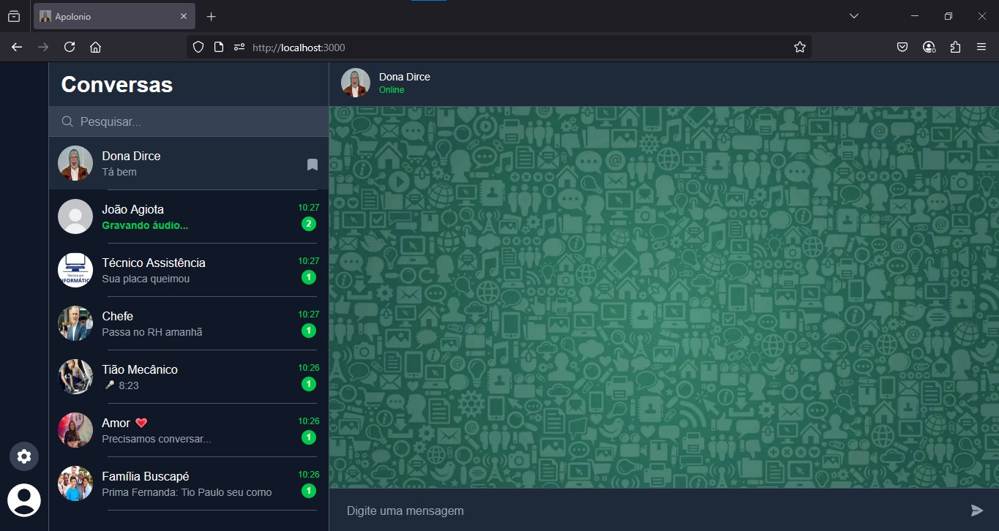

# Apolonio

Apolonio é um simulador interativo que ajuda uma senhora idosa com tarefas simples do dia a dia que para gerações mais jovens são fáceis, mas para ela representam desafios. A interface do simulador é uma reprodução do WhatsApp, onde o jogador pode conversar apenas com a senhora, que pedirá ajuda para realizar atividades como pesquisar receitas ou assistir a missas no YouTube, exigindo muita paciência.

---

## Demonstração

---

## Tecnologias Utilizadas

- Next.js 15.3.2  
- React 19.0.0  
- TypeScript 5  
- TailwindCSS 4  
- Zod 3.24.4  
- Puppeteer 24.8.2  
- React Toastify 11.0.5  
- OpenAI SDK (@ai-sdk/openai e @ai-sdk/react)  
- Heroicons React 2.2.0  

---

## Scripts

- npm run dev — Roda o projeto em modo desenvolvimento com hot reload.  
- npm run build — Gera o build para produção.  
- npm run start — Inicia o servidor em modo produção.  
- npm run lint — Executa o linter para verificar o código.  

---

## Instalação e Uso

1. Clone o repositório:  
   git clone https://github.com/SergioMacedo15/apolonio-back.git

2. Instale as dependências:  
   npm install

3. Inicie o servidor de desenvolvimento:  
   npm run dev

4. Acesse no navegador:  
   http://localhost:3000

5. Comece a ajudar a senhora nas tarefas pelo chat.

---

## Estrutura do Projeto

- /pages — Páginas e rotas do Next.js.  
- /components — Componentes React para o chat, mensagens, interface.  
- /lib — Lógica e integrações com APIs (ex: OpenAI, Puppeteer).  
- /styles — Arquivos de estilos e configuração do TailwindCSS.  
- /public — Assets públicos como imagens e ícones.  

---

## Objetivo do Projeto

Criar uma experiência que estimule a paciência e a empatia ao ajudar uma pessoa idosa a superar dificuldades cotidianas utilizando uma interface familiar e acessível, simulando um chat estilo WhatsApp.

---

## Futuras Melhorias

- Suporte a múltiplas tarefas simultâneas.  
- Funcionalidade de videochamadas ou comandos de voz.  
- Melhorias em acessibilidade (textos maiores, leitura em voz alta).  
- Expansão do repertório de tarefas da senhora.  

---

## Contato

Para dúvidas ou contribuições, abra uma issue ou envie um pull request.

---

## Licença

Este projeto está licenciado sob a MIT License.